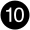
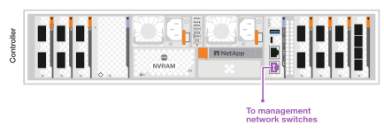
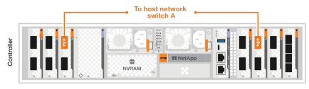
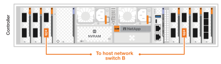

= Die Hardware für Ihr AFX 2K Speichersystem verkabeln
:allow-uri-read: 
:icons: font
:imagesdir: ../media/

[role="lead"]
Nach der Installation der Rack-Hardware für Ihr AFX 2K Speichersystem werden die Netzwerkkabel für die Controller installiert und die Kabel zwischen den Controllern und den Speicherregalen verbunden.

.Bevor Sie beginnen
Wenden Sie sich an Ihren Netzwerkadministrator, um Informationen zum Anschließen des Speichersystems an Ihre Netzwerk-Switches zu erhalten.

.Informationen zu diesem Vorgang
* Diese Verfahren zeigen gängige Konfigurationen.  Die konkrete Verkabelung hängt von den für Ihr Speichersystem bestellten Komponenten ab.  Ausführliche Konfigurationsdetails und Steckplatzprioritäten finden Sie unterlink:https://hwu.netapp.com["NetApp Hardware Universe"^] .
* Die I/O-Steckplätze auf einem AFX 2K Controller sind von 1 bis 11 nummeriert.
+
image::../media/drw_afx_2k_rear_slots_ieops-2862.svg[Steckplatznummerierung auf einem AFX-Controller]

+
[cols="10%,23%,10%,24%,10%,23%"]
|===
| Slotnummer | I/O Steckplatz | Slotnummer | I/O Steckplatz | Slotnummer | I/O Steckplatz 

 a| 
image::../media/icon_round_1.svg[Callout Nummer 1]
| Hochverfügbarkeit  a| 

image::../media/icon_round_5.svg[Callout-Nummer 5]
| NVRAM12  a| 
image::../media/icon_round_9.svg[Callout-Nummer 9]
| Netzwerk 

 a| 
image::../media/icon_round_2.svg[Hinweis Nummer 2]
| Cluster  a| 
image::../media/icon_round_6.svg[Callout-Nummer 6]

image::../media/icon_round_7.svg[Callout-Nummer 7]
| NVRAM12-EX  a| 

| Storage 

 a| 
image::../media/icon_round_3.svg[Callout-Nummer 3]
| Netzwerk  a| 
image::../media/icon_round_8.svg[Callout-Nummer 8]
| Storage  a| 
image::../media/icon_round_11.svg[Callout-Nummer 11]
| (*Optional*) Vier 25GbE SFP28 Ports für zusätzliche Management-Konnektivität 
|===
* Die Verkabelungsgrafiken zeigen Pfeilsymbole, die die richtige Ausrichtung (nach oben oder unten) der Kabelstecker-Aufreißlasche beim Einstecken eines Steckers in einen Port anzeigen.
+
Beim Einstecken des Steckers sollten Sie ein Klicken spüren. Wenn Sie kein Klicken spüren, ziehen Sie ihn heraus, drehen Sie ihn um und versuchen Sie es erneut.

+
image:../media/drw_cable_pull_tab_direction_ieops-1699.svg["Richtung der Kabelaufreißlasche"]

+
[NOTE]
====
Die Steckerteile sind empfindlich und beim Einrasten ist Vorsicht geboten.

====
* Wenn Sie eine Glasfaserverbindung verkabeln, stecken Sie den optischen Transceiver in den Controller-Port, bevor Sie die Verkabelung mit dem Switch-Port herstellen.
* Das AFX 2K Storage System verwendet 400GbE-Kabel. Die 400GbE-Verbindungen bestehen zwischen den Controllern und den Switches. Verbindungen zwischen den Speichergehäusen und den Switches nutzen 4x100GbE-Breakout-Kabel, wobei die 100GbE-Verbindungen an den Ports der Laufwerksgehäuse hergestellt werden.
+
Die Shelf-Storage-Verbindungen können an jeden 100-GbE-Breakout-Port am Switch angeschlossen werden. HA/Cluster-Verbindungen können an jeden 400-GbE-Port am Switch angeschlossen werden. Alle „a“-Controller-Ports werden mit Switch A verbunden, und alle „b“-Controller-Ports werden mit Switch B verbunden.

== Schritt 1: Verbinden Sie die Controller mit dem Verwaltungsnetzwerk

Verbinden Sie den Management-Anschluss (Schraubenschlüssel) jedes Controllers mit einem der Management-Switches oder verbinden Sie ihn direkt mit Ihrem Management-Netzwerk.

Verwenden Sie die 1000BASE-T RJ-45-Kabel, um die Verwaltungsanschlüsse (Schraubenschlüssel) an jedem Controller mit den Verwaltungsnetzwerk-Switches zu verbinden.

image::../media/oie_cable_rj45.png[RJ-45-Kabel]

*1000BASE-T RJ-45-Kabel*

IMPORTANT: Stecken Sie die Netzkabel noch nicht ein.

.Schritte
. Mit dem Managementnetzwerk verbinden.

== Schritt 2: Verbinden Sie die Controller mit dem Host-Netzwerk

Verbinden Sie die Ethernet-Modul-Ports mit Ihrem Host-Netzwerk.

Dieses Verfahren kann je nach Konfiguration Ihres E/A-Moduls unterschiedlich sein.  Nachfolgend sind einige typische Beispiele für die Verkabelung von Hostnetzwerken aufgeführt.  Sehenlink:https://hwu.netapp.com["NetApp Hardware Universe"^] für Ihre spezifische Systemkonfiguration.

.Schritte
. Verbinden Sie die folgenden Ports mit Ihrem Ethernet-Datennetzwerk-Switch A.
+
** Controller
+
*** e3a
*** e9a
+
*400GbE-Kabel*

+
image::../media/oie_cable100_gbe_qsfp28.png[400-Gb-Ethernet-Kabel]

+

. Verbinden Sie die folgenden Ports mit Ihrem Ethernet-Datennetzwerk-Switch B.
+
** Controller
+
*** e3b
*** e9b
+
*400GbE-Kabel*

+
image::../media/oie_cable100_gbe_qsfp28.png[400-Gb-Ethernet-Kabel]

+

== Schritt 3: Cluster- und HA-Verbindungen verkabeln

Das Cluster- und HA-Verbindungskabel dient dazu, die Ports e1a und e2a mit Switch A sowie e1b und e2b mit Switch B zu verbinden. Die Ports e1a/e1b werden für die HA-Verbindungen und die Ports e2a/e2a für die Cluster-Verbindungen genutzt.

.Schritte
. Die folgenden Controller-Ports werden mit einem beliebigen Nicht-ISL-Port am Cluster Netzwerk-Switch A verbunden.
+
** Controller
+
*** e1a (HA)
*** e2a (Cluster)
+
*400GbE-Kabel*

+
image::../media/oie_cable_25Gb_Ethernet_SFP28_ieops-1069.png[Cluster HA Kabel]

+
image::../media/drw_afx_2k_cluster_switch_a_ieops-2866.svg[Kabel-Cluster-Verbindungen zum Cluster-Netzwerk]

. Die folgenden Controller-Ports werden mit einem beliebigen Nicht-ISL-Port am Cluster Netzwerk-Switch B verbunden.
+
** Controller
+
*** e1b (HA)
*** e2b (Cluster)
+
*400GbE-Kabel*

+
image::../media/oie_cable_25Gb_Ethernet_SFP28_ieops-1069.png[Cluster HA Kabel]

+
image::../media/drw_afx_2k_cluster_switch_b_ieops-2867.svg[Kabel-Cluster-Verbindungen zum Cluster-Netzwerk]

== Schritt 4: Verkabelung der Speicherverbindungen zwischen Controller und Switch

Die Speicher-Ports des Controllers mit den Switches verbinden. Es sollte sichergestellt sein, dass die passenden Kabel und Anschlüsse für die Switches vorhanden sind. Siehe  https://hwu.netapp.com["Hardware Universe"^] für weitere Informationen.

NOTE: Die Ports e10b und e8a an den Controllern sind in der AFX 2K Storage Systemkonfiguration für Speicherverbindungen ungenutzt.

.Schritte
. Die folgenden Speicherports werden mit einem beliebigen Nicht-ISL-Port an Switch A verbunden.
+
** Controller
+
*** e10a
+
*400GbE-Kabel*

+
image::../media/oie_cable100_gbe_qsfp28.png[100-Gb-Kabel]

+
image::../media/drw_afx_2k_storage_connection_a_ieops-2868.svg[Controller-Storage mit Switch A verkabeln]

. Die folgenden Speicherports sind mit einem beliebigen Nicht-ISL-Port an Switch B zu verbinden.
+
** Controller
+
*** e8b
+
*400GbE-Kabel*

+
image::../media/oie_cable100_gbe_qsfp28.png[100-Gb-Kabel]

+
image::../media/drw_afx_2k_storage_connection_b_ieops-2870.svg[Controller-Speicher mit Switch B verkabeln]

== Schritt 5: Verkabeln Sie die Verbindungen zwischen Regal und Switch

Die NX224 Speichergehäuse werden mit den 100GbE Breakout-Ports der Switches verbunden.

Informationen zur maximalen Anzahl der für Ihr Speichersystem unterstützten Einschübe und zu allen Verkabelungsoptionen finden Sie unterlink:https://hwu.netapp.com["NetApp Hardware Universe"^] .

.Schritte
. Die folgenden Shelf-Ports werden mit einem beliebigen Breakout-Port an Switch A und Switch B für Modul A verbunden.
+
** Verbindungen von Modul A zu Switch A
+
*** e1a
*** e2a
*** e3a
*** e4a

** Verbindungen von Modul A zu Switch B
+
*** e1b
*** e2b
*** e3b
*** e4b
+
*100GbE-Kabel*

+
image::../media/oie_cable100_gbe_qsfp28.png[100-Gb-Kabel]

+
image::../media/drw_afx_shelf_cabling_a_ieops-2356.svg[Kabelablage zu Schalter A und Schalter B]

. Die folgenden Shelf-Ports werden mit einem beliebigen Breakout-Port an Switch A und Switch B für Modul B verbunden.
+
** Verbindungen von Modul B zu Switch A
+
*** e1a
*** e2a
*** e3a
*** e4a

** Verbindungen von Modul B zu Switch B
+
*** e1b
*** e2b
*** e3b
*** e4b
+
*100GbE-Kabel*

+
image::../media/oie_cable100_gbe_qsfp28.png[100-Gb-Kabel]

+
image::../media/drw_afx_shelf_cabling_b_ieops-2357.svg[Kabelablage zu Schalter A und Schalter B]

.Wie geht es weiter?
Nach der Verkabelung der Hardwarelink:power-on-configure-switch.html["Schalten Sie die Switches ein und konfigurieren Sie sie"] .
