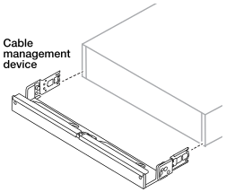

= Installieren Sie Ihr AFX 2K Storage-System
:allow-uri-read: 
:icons: font
:imagesdir: ../media/

[role="lead"]
Nach der Installation der Switches sollte die Hardware für Ihr AFX 2K Storage System installiert werden. Zuerst werden die Schienensätze installiert. Anschließend wird das Speichersystem in einem Schrank oder Telco-Rack installiert und gesichert.

.Bevor Sie beginnen
* Stellen Sie sicher, dass Sie die dem Schienensatz beiliegende Anleitung haben.
* Machen Sie sich mit den Sicherheitsbedenken im Zusammenhang mit dem Gewicht des Lagersystems und des Lagerregals vertraut.
* Beachten Sie, dass der Luftstrom durch das Speichersystem von vorne eintritt, wo die Blende oder Endkappen installiert sind, und von hinten, wo sich die Anschlüsse befinden, ausströmt.

CAUTION: Tragen Sie bei Installations- und Wartungsarbeiten stets ein geerdetes Armband, das mit einem geprüften Erdungspunkt verbunden ist. Die Nichtbeachtung der richtigen ESD-Schutzmaßnahmen kann zu dauerhaften Schäden an Controller-Knoten, Storage Shelves und Network Switches führen.

.Schritte
. Installieren Sie die Schienensätze für Ihr Lagersystem und die Lagerregale nach Bedarf anhand der den Sätzen beiliegenden Anweisungen.
. Installieren und sichern Sie Ihren Controller im Schrank oder Telco-Rack:
+
.. Positionieren Sie das Speichersystem auf den Schienen in der Mitte des Schranks oder Telco-Racks, stützen Sie das Speichersystem dann von unten ab und schieben Sie es an seinen Platz.
.. Befestigen Sie das Speichersystem mit den mitgelieferten Befestigungsschrauben am Schrank oder Telco-Rack.

. Befestigen Sie die Blende an der Vorderseite des Controllers.
. Falls Ihrem AFX 2K Speichersystem eine Kabelmanagementvorrichtung beilag, ist diese an der Rückseite des Speichersystems anzubringen.
+

. Lagerregal montieren und befestigen:
+
.. Positionieren Sie die Rückseite des Lagerregals auf den Schienen, stützen Sie das Regal dann von unten ab und schieben Sie es in den Schrank oder das Telco-Rack.
+
Generell sollten Ablagefächer und Controller in unmittelbarer Nähe der Switches installiert werden.  Wenn Sie mehrere Lagerregale installieren, platzieren Sie das erste Lagerregal direkt über den Controllern.  Platzieren Sie das zweite Ablagefach direkt unter den Controllern.  Wiederholen Sie dieses Muster für alle weiteren Lagerregale.

.. Befestigen Sie das Lagerregal mit den mitgelieferten Befestigungsschrauben am Schrank oder Telco-Rack.

.Wie geht es weiter?
Nachdem Sie die Hardware für Ihr AFX-System installiert haben, prüfen Sie die link:afx-cable-overview.html["Unterstützte Kabelkonfigurationen für Ihr AFX 2K Storage-System"].
