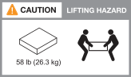

= Installationsvoraussetzungen für AFX 2K Speichersysteme
:allow-uri-read: 
:icons: font
:imagesdir: ../media/

[role="lead"]
Die benötigte Ausrüstung und die Sicherheitsvorkehrungen beim Heben für den AFX 2K Storage Controller und die Storage Shelves werden dargestellt.

[[equipment-needed-for-install]]
== Für die Installation benötigte Ausrüstung

Für die Installation Ihres AFX 2K Speichersystems werden folgende Geräte und Werkzeuge benötigt.

* Zugriff auf einen Webbrowser zur Konfiguration Ihres Speichersystems
* Band zur elektrostatischen Entladung (ESD)
* Taschenlampe
* Laptop oder Konsole mit USB-/Seriellem Anschluss
* Büroklammer oder Kugelschreiber mit schmaler Spitze zum Festlegen der Lagerregal-IDs
* Kreuzschlitzschraubendreher Nr. 2

[[lifting-precautions]]
== Vorsichtsmaßnahmen beim Heben

AFX-Speichercontroller und Speicherregale sind schwer.  Seien Sie beim Anheben und Bewegen dieser Gegenstände vorsichtig.

[[storage-controller-weights]]
=== Speichercontrollergewichte

Beim Bewegen oder Anheben des AFX 2K Speichercontrollers sind die erforderlichen Vorsichtsmaßnahmen zu treffen.

Ein AFX 2K Speichercontroller kann bis zu 64,0 lb (29,03 kg) wiegen. Für das Anheben des Speichercontrollers sind zwei Personen oder ein hydraulischer Lift erforderlich.

.Vorsichtsmaßnahme beim Anheben des AFX 2K Controller.
image::../media/drw_afx_2k_weight_caution_ieops-2938.svg[AFX 2K Controller Warnsymbol]

[[storage-shelf-weights]]
=== Gewichte für Lagerregale

Treffen Sie die notwendigen Vorsichtsmaßnahmen, wenn Sie Ihr Regal bewegen oder anheben.

.NX224 Regal
Ein NX224-Regal kann bis zu 60,1 lb (27,3 kg) wiegen. Zum Anheben des Regals sollten zwei Personen oder ein hydraulischer Lift verwendet werden. Alle Komponenten sollten sich im Regal befinden (sowohl vorne als auch hinten), um ein Ungleichgewicht des Regalgewichts zu vermeiden.

.Vorsichtsmaßnahme beim Anheben des NX224 Shelfs.
image::../media/drw_nx224_lifting_weight_ieops-2437.svg[NX224 NSM100 Hebe-Warnsymbol]

[[switch-weights]]
=== Switch-Gewichte

Beim Bewegen oder Anheben Ihres Netzwerk-Switches sind die erforderlichen Vorsichtsmaßnahmen zu treffen.

.Cisco Nexus 9808
Ein unbeladener Cisco 9808 kann bis zu link:https://www.cisco.com/c/en/us/products/collateral/switches/nexus-9000-series-switches/nexus9800-series-switches-ds.html#Productspecifications["162 lb (73 kg) und ein voll bestückter Cisco 9808 Switch kann bis zu 766 lb (347 kg) wiegen"^] wiegen. Zum Anheben des Switches ist ein hydraulischer Lift zu verwenden.

.Vorsichtsmaßnahme beim Anheben eines unbeladenen Cisco Nexus 9808.
image::../media/drw_afx_2k_weight_icon_ieops-2939.svg[Cisco Nexus 9808 Vorsichtssymbol für das Anheben]

.Vorsichtsmaßnahme beim Anheben eines voll beladenen Cisco Nexus 9808.
image::../media/drw_afx_2k_nexus9808_loaded_weight_caution_ieops-2940.svg[Cisco Nexus 9808 Warnsymbol für vollständiges Anheben]

.Cisco Nexus9332D-GX2B
Ein Cisco 9332D-GX2B kann bis zu link:https://www.cisco.com/c/en/us/td/docs/dcn/hw/aci/nexus9000/9332d-gx2b/cisco-nexus-9332d-gx2b-aci-mode-switch-hardware-installation-guide/m_n93xxx_system_specs.html["12,7 kg (28,1 lb)"^] wiegen.

.Cisco Nexus 9364D-GX2A
Ein Cisco Nexus 9364D-GX2A Switch kann bis zu link:https://www.cisco.com/c/en/us/td/docs/dcn/hw/nx-os/nexus9000/9364d-gx2a/cisco-nexus-9364d-gx2a-nx-os-mode-switch-hardware-installation-guide/m_n93xxx_system_specs.html["58 lb (26,3 kg)"^] wiegen. Für das Anheben des Switches sind zwei Personen oder ein hydraulischer Hubwagen erforderlich.

.Vorsichtsmaßnahme beim Anheben des Cisco Nexus 9364D-GX2A.

.Ähnliche Informationen
* https://library.netapp.com/ecm/ecm_download_file/ECMP12475945["Sicherheitsinformationen und behördliche Hinweise"^]

.Wie geht es weiter?
Nachdem Sie die Hardwareanforderungen geprüft haben, link:prepare-hardware.html["Vorbereitung der Installation Ihres AFX 2K Speichersystems"].
