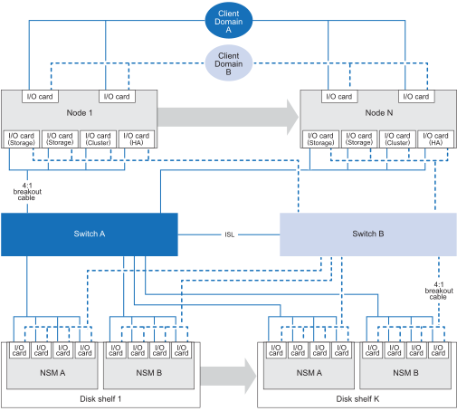

= Unterstützte Konfigurationen für Ihr AFX 1K-Speichersystem
:allow-uri-read: 
:icons: font
:imagesdir: ../media/

[role="lead"]
Informieren Sie sich über die unterstützten Hardwarekomponenten und Verkabelungsoptionen für das AFX 1K-Speichersystem, einschließlich kompatibler Speicherplattenregale, Switches und Kabeltypen, die für eine ordnungsgemäße Systemeinrichtung erforderlich sind.

== Unterstützte AFX 1K-Verkabelungskonfiguration

Die Erstkonfiguration des AFX 1K-Speichersystems unterstützt mindestens vier Controllerknoten, die über Dual-Switches mit den Speicherplatten-Shelves verbunden sind.

Zusätzliche Controllerknoten und Festplattenregale erweitern die anfängliche Konfiguration des AFX 1K-Speichersystems.  Erweiterte AFX 1K-Konfigurationen folgen derselben Switch-basierten Verkabelungsmethode wie das unten dargestellte Schema.

== Unterstützte Hardwarekomponenten

Überprüfen Sie die kompatiblen Speicherplattenregale, Switches und Kabeltypen für das AFX 1K-Speichersystem.

[cols="2,2,3,6"]
|===
| *Controller-Regal* | *Festplattenregal* | *Unterstützte Switches* | *Unterstützte Kabel* 

 a| 
AFX 1K
 a| 
NX224
 a| 
* Cisco Nexus 9332D-GX2B (400GbE)
* Cisco Nexus 9364D-GX2A (400GbE)

 a| 
* 400GbE QSFP-DD Breakout-Kabel auf 4x100GbE QSFP Breakout-Kabel
+

NOTE: Für 100-GbE-Verbindungen zwischen den Switches, Controllern und Disk-Shelves werden Breakout-Kabel verwendet.

+
** 100-GbE-Kabel zum Controller-Cluster und zu HA-Ports
** 100GbE-Kabel zu Festplattenregalen

* 2 x 400GbE-Kabel für ISL-Verbindungen zwischen Switch A und Switch B
* RJ-45-Kabel für Management-Verbindungen

|===
.Wie geht es weiter?
Nachdem Sie die unterstützte Systemkonfiguration und die Hardwarekomponenten überprüft haben,link:install-network-reqs.html["Überprüfen Sie die Netzwerkanforderungen für Ihr AFX 1K-Speichersystem"] .
