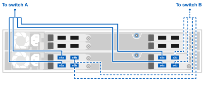

= Verkabeln Sie die Hardware für Ihr AFX 1K-Speichersystem
:allow-uri-read: 
:icons: font
:imagesdir: ../media/

[role="lead"]
Nachdem Sie die Rack-Hardware für Ihr AFX 1K-Speichersystem installiert haben, installieren Sie die Netzwerkkabel für die Controller und verbinden Sie die Kabel zwischen den Controllern und den Speicherregalen.

.Bevor Sie beginnen
Wenden Sie sich an Ihren Netzwerkadministrator, um Informationen zum Anschließen des Speichersystems an Ihre Netzwerk-Switches zu erhalten.

.Informationen zu diesem Vorgang
* Diese Verfahren zeigen gängige Konfigurationen.  Die konkrete Verkabelung hängt von den für Ihr Speichersystem bestellten Komponenten ab.  Ausführliche Konfigurationsdetails und Steckplatzprioritäten finden Sie unterlink:https://hwu.netapp.com["NetApp Hardware Universe"^] .
* Die E/A-Steckplätze eines AFX-Controllers sind von 1 bis 11 nummeriert.
+
image::../media/drw_a1K_back_slots_labeled_ieops-2162.svg[Steckplatznummerierung auf einem AFX-Controller]

* Die Verkabelungsgrafiken zeigen Pfeilsymbole, die die richtige Ausrichtung (nach oben oder unten) der Kabelstecker-Aufreißlasche beim Einstecken eines Steckers in einen Port anzeigen.
+
Beim Einstecken des Steckers sollten Sie ein Klicken spüren. Wenn Sie kein Klicken spüren, ziehen Sie ihn heraus, drehen Sie ihn um und versuchen Sie es erneut.

+
image:../media/drw_cable_pull_tab_direction_ieops-1699.svg["Richtung der Kabelaufreißlasche"]

+
[NOTE]
====
Die Steckerteile sind empfindlich und beim Einrasten ist Vorsicht geboten.

====
* Wenn Sie eine Glasfaserverbindung verkabeln, stecken Sie den optischen Transceiver in den Controller-Port, bevor Sie die Verkabelung mit dem Switch-Port herstellen.
* Das AFX 1K-Speichersystem verwendet 4x100GbE-Breakout-Kabel im Cluster- und Speichernetzwerk.  Die 400-GbE-Verbindungen werden zu den Switch-Ports und die 100-GbE-Verbindungen zu den Controller- und Laufwerksregal-Ports hergestellt.  Speicher- und HA/Cluster-Verbindungen können zu jedem Nicht-ISL-Port auf dem Switch hergestellt werden.
+
Für eine bestimmte 4x100GbE-Breakout-Kabelverbindung zum spezifischen Switch-Port verbinden Sie alle 4 Ports, die zum Switch führen, über dieses einzelne Breakout-Kabel.

+
** 1 x HA-Port (Steckplatz 1)
** 1 x Cluster-Port (Steckplatz 7)
** 2 X Speicherports (Steckplätze 10, 11)
+
Alle „a“-Ports sind mit Switch A verbunden und alle „b“-Ports sind mit Switch B verbunden.

NOTE: Für Cisco Nexus 9332D-GX2B- und 9364D-GX2A-Switch-Konfigurationen zum AFX 1K-Speichersystem sind 4x100GbE-Breakout-Kabelverbindungen erforderlich.

== Schritt 1: Verbinden Sie die Controller mit dem Verwaltungsnetzwerk

Verbinden Sie den Verwaltungsport an jedem Switch mit einem der Verwaltungsswitches (falls bestellt) oder verbinden Sie sie direkt mit Ihrem Verwaltungsnetzwerk.

Der Verwaltungsport ist der obere rechte Port auf der Netzteilseite des Switches.  Das CAT6-Kabel für jeden Switch muss nach der Installation der Switches durch das Durchgangspanel geführt werden, um eine Verbindung zu den Verwaltungs-Switches oder dem Verwaltungsnetzwerk herzustellen.

Verwenden Sie die 1000BASE-T RJ-45-Kabel, um die Verwaltungsanschlüsse (Schraubenschlüssel) an jedem Controller mit den Verwaltungsnetzwerk-Switches zu verbinden.

*1000BASE-T RJ-45-Kabel*

image::../media/drw_afx_management_connection_ieops-2349.svg[Stellen Sie eine Verbindung zu Ihrem Verwaltungsnetzwerk her]

IMPORTANT: Stecken Sie die Netzkabel noch nicht ein.

. Mit dem Hostnetzwerk verbinden.

== Schritt 2: Verbinden Sie die Controller mit dem Host-Netzwerk

Verbinden Sie die Ethernet-Modul-Ports mit Ihrem Host-Netzwerk.

Dieses Verfahren kann je nach Konfiguration Ihres E/A-Moduls unterschiedlich sein.  Nachfolgend sind einige typische Beispiele für die Verkabelung von Hostnetzwerken aufgeführt.  Sehenlink:https://hwu.netapp.com["NetApp Hardware Universe"^] für Ihre spezifische Systemkonfiguration.

.Schritte
. Verbinden Sie die folgenden Ports mit Ihrem Ethernet-Datennetzwerk-Switch A.
+
** Controller A (Beispiel)
+
*** e2a
*** e3a

** Controller B (Beispiel)
+
*** e2a
*** e3a
+
*100GbE-Kabel*

+
image::../media/oie_cable100_gbe_qsfp28.png[100-Gb-Ethernet-Kabel]

+
image::../media/drw_afx_network_cabling_a_ieops-2350.svg[Kabel zum Ethernet-Netzwerk]

. Verbinden Sie die folgenden Ports mit Ihrem Ethernet-Datennetzwerk-Switch B.
+
** Controller A (Beispiel)
+
*** e2b
*** e3b

** Controller B (Beispiel)
+
*** e2b
*** e3b
+
*100GbE-Kabel*

+
image::../media/oie_cable100_gbe_qsfp28.png[100-Gb-Ethernet-Kabel]

+
image::../media/drw_afx_network_cabling_b_ieops-2351.svg[Kabel zum Ethernet-Netzwerk]

== Schritt 3: Verkabeln Sie die Cluster- und HA-Verbindungen

Verwenden Sie das Cluster- und HA-Verbindungskabel, um die Ports e1a und e7a mit Switch A und e1b und e7b mit Switch B zu verbinden. Die Ports e1a/e1b werden für die HA-Verbindungen verwendet und die Ports e7a/e7b für die Cluster-Verbindungen.

.Schritte
. Verbinden Sie die folgenden Controller-Ports mit einem beliebigen Nicht-ISL-Port am Cluster-Netzwerk-Switch A.
+
** Controller A
+
*** e1a
*** e7a

** Controller B
+
*** e1a
*** e7a
+
*100GbE-Kabel*

+
image::../media/oie_cable_25Gb_Ethernet_SFP28_ieops-1069.png[Cluster-HA-Kabel]

+
image::../media/drw_afx_switched_cluster_cabling_a_ieops-2352.svg[Verkabeln Sie Clusterverbindungen mit dem Clusternetzwerk]

. Verbinden Sie die folgenden Controller-Ports mit einem beliebigen Nicht-ISL-Port am Cluster-Netzwerk-Switch B.
+
** Controller A
+
*** e1b
*** e7b

** Controller B
+
*** e1b
*** e7b
+
*100GbE-Kabel*

+
image::../media/oie_cable_25Gb_Ethernet_SFP28_ieops-1069.png[Cluster-HA-Kabel]

+
image::../media/drw_afx_switched_cluster_cabling_b_ieops-2353.svg[Verkabeln Sie Clusterverbindungen mit dem Clusternetzwerk]

== Schritt 4: Verkabeln Sie die Speicherverbindungen zwischen Controller und Switch

Verbinden Sie die Speicherports des Controllers mit den Switches.  Stellen Sie sicher, dass Sie die richtigen Kabel und Anschlüsse für Ihre Switches haben. Sehen https://hwu.netapp.com["Hardware Universe"^] für weitere Informationen.

. Verbinden Sie die folgenden Speicherports mit einem beliebigen Nicht-ISL-Port auf Switch A.
+
** Controller A
+
*** e10a
*** e11a

** Controller B
+
*** e10a
*** e11a
+
*100GbE-Kabel*

+
image::../media/oie_cable100_gbe_qsfp28.png[100-Gb-Kabel]

+
image::../media/drw_afx_controller_storage_cable_a_ieops-2354.svg[Kabel-Controller-Speicher an Schalter A]

. Verbinden Sie die folgenden Speicherports mit einem beliebigen Nicht-ISL-Port auf Switch B.
+
** Controller A
+
*** e10b
*** e11b

** Controller B
+
*** e10b
*** e11b
+
*100GbE-Kabel*

+
image::../media/oie_cable100_gbe_qsfp28.png[100-Gb-Kabel]

+
image::../media/drw_afx_controller_storage_cable_b_ieops-2355.svg[Kabel-Controller-Speicher an Schalter B]

== Schritt 5: Verkabeln Sie die Verbindungen zwischen Regal und Switch

Verbinden Sie die NX224-Speicherregale mit den Switches.

Informationen zur maximalen Anzahl der für Ihr Speichersystem unterstützten Einschübe und zu allen Verkabelungsoptionen finden Sie unterlink:https://hwu.netapp.com["NetApp Hardware Universe"^] .

. Verbinden Sie die folgenden Shelf-Ports mit einem beliebigen Nicht-ISL-Port an Switch A und Switch B für Modul A.
+
** Verbindungen von Modul A zu Switch A
+
*** e1a
*** e2a
*** e3a
*** e4a

** Verbindungen von Modul A zu Switch B
+
*** e1b
*** e2b
*** e3b
*** e4b
+
*100GbE-Kabel*

+
image::../media/oie_cable100_gbe_qsfp28.png[100-Gb-Kabel]

+
image::../media/drw_afx_shelf_cabling_a_ieops-2356.svg[Kabelablage zu Schalter A und Schalter B]

. Verbinden Sie die folgenden Shelf-Ports mit einem beliebigen Nicht-ISL-Port an Switch A und Switch B für Modul B.
+
** Verbindungen von Modul B zu Switch A
+
*** e1a
*** e2a
*** e3a
*** e4a

** Verbindungen von Modul B zu Switch B
+
*** e1b
*** e2b
*** e3b
*** e4b
+
*100GbE-Kabel*

+
image::../media/oie_cable100_gbe_qsfp28.png[100-Gb-Kabel]

+

.Wie geht es weiter?
Nach der Verkabelung der Hardwarelink:power-on-configure-switch.html["Schalten Sie die Switches ein und konfigurieren Sie sie"] .
