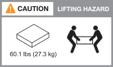

= Installationsvoraussetzungen für AFX 1K-Speichersysteme
:allow-uri-read: 
:icons: font
:imagesdir: ../media/

[role="lead"]
Überprüfen Sie die erforderliche Ausrüstung und die Hebevorkehrungen für Ihren AFX 1K-Speichercontroller und die Lagerregale.

== Für die Installation benötigte Ausrüstung

Zur Installation Ihres AFX 1K-Speichersystems benötigen Sie die folgende Ausrüstung und Werkzeuge.

* Zugriff auf einen Webbrowser zur Konfiguration Ihres Speichersystems
* Band zur elektrostatischen Entladung (ESD)
* Taschenlampe
* Laptop oder Konsole mit USB-/Seriellem Anschluss
* Büroklammer oder Kugelschreiber mit schmaler Spitze zum Festlegen der Lagerregal-IDs
* Kreuzschlitzschraubendreher Nr. 2

== Vorsichtsmaßnahmen beim Heben

AFX-Speichercontroller und Speicherregale sind schwer.  Seien Sie beim Anheben und Bewegen dieser Gegenstände vorsichtig.

=== Speichercontrollergewichte

Treffen Sie die erforderlichen Vorsichtsmaßnahmen, wenn Sie Ihren AFX 1K-Speichercontroller bewegen oder anheben.

Ein AFX 1K-Speichercontroller kann bis zu 28,5 kg (62,83 lbs) wiegen.  Zum Anheben des Speichercontrollers sind zwei Personen oder eine Hebebühne erforderlich.

image::../media/drw_a1k_weight_caution_ieops-1698.svg[ASA A1K-Hebe-Warnsymbol]

=== Gewichte für Lagerregale

Treffen Sie die notwendigen Vorsichtsmaßnahmen, wenn Sie Ihr Regal bewegen oder anheben.

.NX224 Regal
--
Ein NX224-Regal kann bis zu 27,3 kg (60,1 lbs) wiegen.  Zum Anheben des Regals sind zwei Personen oder eine Hebebühne erforderlich.  Bewahren Sie alle Komponenten im Regal auf (sowohl vorne als auch hinten), um ein Ungleichgewicht des Regalgewichts zu vermeiden.

.Ähnliche Informationen
* https://library.netapp.com/ecm/ecm_download_file/ECMP12475945["Sicherheitsinformationen und behördliche Hinweise"^]

.Wie geht es weiter?
Nachdem Sie die Hardwareanforderungen überprüft haben,link:prepare-hardware.html["Bereiten Sie die Installation Ihres AFX 1K-Speichersystems vor"] .

--