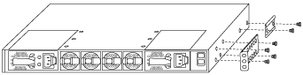

= Installieren Sie die Switches für Ihr AFX 1K-Speichersystem
:allow-uri-read: 
:icons: font
:imagesdir: ../media/

[role="lead"]
Nachdem Sie Ihre Vorbereitungen für die Installation des AFX 1K-Speichersystems abgeschlossen haben, sollten Sie die Switches im Schrank oder Telco-Rack installieren.

Installieren Sie Cisco Nexus 9332D-GX2B- oder 9364D-GX2A-Switches im Schrank oder Rack.  Installieren Sie ein Pass-Through-Panel-Kit, wenn Sie den Cisco Nexus 9364D-GX2A-Switch verwenden.

.Bevor Sie beginnen
Stellen Sie sicher, dass Sie über die folgenden Komponenten verfügen:

* Das Pass-Through-Panel-Kit, das bei NetApp erhältlich ist (Teilenummer X8784-R6).
+
Das NetApp Pass-Through-Panel-Kit enthält die folgende Hardware:

+
** Eine Durchgangs-Blindplatte
** Vier 10-32 x 0,75 Schrauben
** Vier 10-32 Clipmuttern

* Für jeden Schalter acht 10-32- oder 12-24-Schrauben und Clipmuttern zur Befestigung der Halterungen und Gleitschienen an den vorderen und hinteren Schrankpfosten.
* Das Cisco Standard-Schienenkit zur Installation des Switches in einem NetApp Schrank.

NOTE: Überbrückungskabel sind nicht im Durchgangskit enthalten.  Wenden Sie sich an NetApp , um die richtigen Überbrückungskabel zu bestellen, wenn diese nicht im Lieferumfang Ihrer Switches enthalten sind.

NOTE: Cisco 9332D-GX2B und 9364D-GX2A sind Port-Side-Intake-Switches.  Die Netzwerkanschlüsse für die Switches müssen zur Vorderseite des Schranks zeigend installiert werden und die Abluftventilatoren müssen zur Rückseite des Schranks zeigen.  Bei dieser Konfiguration müssen Sie sicherstellen, dass Sie Kabel verwenden, die lang genug sind, um von den Netzwerkanschlüssen an der Vorderseite des Schranks zu den Speicheranschlüssen an der Rückseite des Schranks zu reichen.  + Ausführlichere Informationen zu diesen Switches finden Sie auf der Cisco -Website: https://www.cisco.com/c/en/us/td/docs/dcn/hw/nx-os/nexus9000/9332d-gx2b/cisco-nexus-9332d-gx2b-nx-os-mode-switch-hardware-installation-guide.html["Cisco Nexus 9332D-GX2B NX-OS-Modusschalter – Hardwareinstallationshandbuch"^] Und https://www.cisco.com/c/en/us/td/docs/dcn/hw/nx-os/nexus9000/9364d-gx2a/cisco-nexus-9364d-gx2a-nx-os-mode-switch-hardware-installation-guide.html["Cisco Nexus 9364D-GX2A NX-OS-Modusschalter – Hardwareinstallationshandbuch"^] .

.Schritte
. Installieren Sie die Durchgangs-Abdeckplatte.
+
.. Bestimmen Sie die vertikale Position der Schalter und der Blindplatte im Schrank oder Rack.
.. Montieren Sie auf jeder Seite zwei Clipmuttern in den entsprechenden quadratischen Löchern für die vorderen Schrankschienen.
.. Zentrieren Sie das Panel vertikal, um ein Eindringen in den angrenzenden Rack-Bereich zu verhindern, und ziehen Sie dann die Schrauben fest.
.. Führen Sie die Buchsenstecker beider Überbrückungskabel von der Rückseite des Panels durch die Bürstenbaugruppe ein.
+
image::../media/cisco_9148_jumper_cords.gif[Buchsenstecker des Starthilfekabels]

+
[cols="1,4"]
|===

 a| 
image::../media/icon_round_1.png[Callout Nummer 1]
 a| 
Buchse des Starthilfekabels.

|===

. Installieren Sie die Rackmontagehalterungen am Switch-Gehäuse.
+
.. Positionieren Sie eine vordere Rackmontagehalterung auf einer Seite des Switch-Gehäuses, sodass die Montageöse mit der Gehäusefrontplatte (auf der Netzteil- oder Lüfterseite) ausgerichtet ist, und befestigen Sie die Halterung dann mit vier M4-Schrauben am Gehäuse.
+

.. Wiederholen Sie Schritt 2a mit der anderen vorderen Rackmontagehalterung auf der anderen Seite des Switches.
.. Installieren Sie die hintere Rackmontagehalterung am Switch-Gehäuse.
.. Wiederholen Sie Schritt 2c mit der anderen hinteren Rackmontagehalterung auf der anderen Seite des Switches.

. Installieren Sie die Clipmuttern in den quadratischen Lochpositionen für alle vier IEA-Pfosten.
+
image::../media/ru_locations_for_3132q_v.gif[Positionen der Clipmuttern]

+
Montieren Sie die beiden 9332D-GX2B-Switches an Schrankpositionen, die einen effizienten Zugriff auf Controller und Regale ermöglichen, beispielsweise in den mittleren Reihen.

. Installieren Sie die Gleitschienen im Schrank oder Rack.
+
.. Positionieren Sie die erste Gleitschiene an der gewünschten Stelle auf der Rückseite des hinteren linken Pfostens, setzen Sie Schrauben mit dem passenden Gewindetyp ein und ziehen Sie die Schrauben anschließend mit den Fingern fest.
+
image::../media/drw_3132q_v_slider_rails_ieops-2494.svg[Gleitschienenmontage]

+
[cols="1,4"]
|===

 a| 
image::../media/icon_round_1.png[Callout Nummer 1]
 a| 
Richten Sie die Gleitschiene beim vorsichtigen Verschieben an den Schraubenlöchern im Rack aus.

 a| 
image::../media/icon_round_2.png[Hinweis Nummer 2]
 a| 
Ziehen Sie die Schrauben der Gleitschienen an den Schrankpfosten fest.

|===
.. Wiederholen Sie Schritt 4a für den rechten hinteren Pfosten.
.. Wiederholen Sie die Schritte 4a und 4b an den gewünschten Stellen am Schrank.

. Installieren Sie den Switch im Schrank oder Rack.
+

NOTE: Für diesen Schritt sind zwei Personen erforderlich: eine Person, die den Schalter von vorne stützt, und eine andere, die den Schalter in die hinteren Gleitschienen führt.

+
.. Positionieren Sie die Rückseite des Schalters an der gewünschten Stelle am Schrank.
+
image::../media/drw_switch_cabinet_position_generic_ieops-2348.svg[3232C Positionierung bei U39-40]

+
[cols="1,4"]
|===

 a| 
image::../media/icon_round_1.png[Callout Nummer 1]
 a| 
Wenn das Chassis in Richtung der hinteren Pfosten geschoben wird, richten Sie die beiden hinteren Rack-Montageführungen mit den Gleitschienen aus

 a| 
image::../media/icon_round_2.png[Hinweis Nummer 2]
 a| 
Schieben Sie den Schalter vorsichtig, bis die vorderen Rackmontagehalterungen bündig mit den vorderen Pfosten abschließen.

|===
.. Befestigen Sie den Switch am Schrank oder Rack.
+
image::../media/3132q_attaching.gif[Schalteraufsatz]

+
[cols="1,4"]
|===

 a| 
image::../media/icon_round_1.png[Callout Nummer 1]
 a| 
Während eine Person die Vorderseite des Gehäuses waagerecht hält, sollte die andere Person die vier hinteren Schrauben an den Schrankpfosten festziehen.

|===
.. Wenn das Chassis nun ohne Hilfe gestützt wird, ziehen Sie die vorderen Schrauben an den Pfosten vollständig fest.
.. Wiederholen Sie die Schritte 5a bis 5c für den zweiten Schalter an der gewünschten Stelle am Schrank.
+

NOTE: Durch die Verwendung des fertig montierten Schalters als Stütze ist es nicht notwendig, den zweiten Schalter während des Montagevorgangs vorne festzuhalten.

. Wenn die Schalter installiert sind, schließen Sie die Überbrückungskabel an die Stromeingänge der Schalter an.
. Schließen Sie die Stecker beider Überbrückungskabel an die nächstgelegenen verfügbaren PDU-Steckdosen an.
+

NOTE: Um die Redundanz aufrechtzuerhalten, müssen die beiden Kabel an verschiedene PDUs angeschlossen werden.

. Verbinden Sie den Verwaltungsport an jedem Switch mit einem der Verwaltungsswitches (falls bestellt) oder verbinden Sie sie direkt mit Ihrem Verwaltungsnetzwerk.
+
Der Verwaltungsnetzwerkanschluss ist der untere RJ-45-Anschluss in der Nähe des rechten Netzteils.  Führen Sie das CAT6-Kabel für jeden Switch nach der Installation der Switches durch die Durchgangsplatte, um eine Verbindung zu den Verwaltungsswitches oder dem Netzwerk herzustellen.

.Wie geht es weiter?
Nachdem Sie die Switches im Schrank oder Rack installiert haben,link:deploy-hardware.html["Installieren Sie das AFX 1K-Speichersystem und die Regale im Schrank oder Rack"] .
